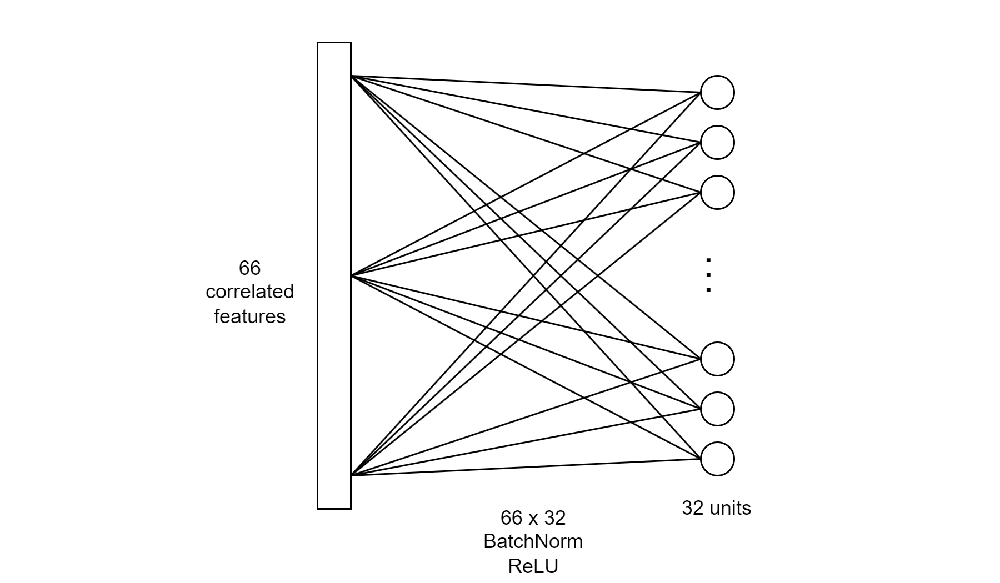

# TurboCast: Experimental short-term weather CNN-GRU prediction model
__BANJO Analytics__: Jeff Chen, Alec Mak, Norbert Irisk, Matthew Pascal
___
TurboCast is an advanced, short-term local weather prediction model leveraging a hybrid CNN-GRU architecture for 
high-performance forecasting.The model combines inputs from weather radars and weather stations to forecast weather 
conditions for the subsequent two hours following the input period. Check out our [Medium Article](https://medium.com/@frogocomics/forecasting-tomorrow-7979f5b35599) for more information.

For each time step, the weather station data is first processed.

Next, each radar image is processed.

The two inputs are combined for each time step and fed into a double-layer residual GRU network.


### File Structure
- [/images](./images) is the output location of all visualizations
- [/bin](./bin) is the location of where Chrome binaries should be placed
- [/src/data/radar](./src/data/radar) is the location of all radar downloading/processing code
- [/src/data/weather](./src/data/weather) is the location of all weather downloading/processing code
- [/src/data/eda](./src/data/eda) is the location of all EDA code
- [/src/model](./src/model) is the location of all deep learning model code
- [/src/model/outputs](./src/model/outputs) is the location of all model outputs

### Data Fetching
Although the processed weather station data is already available in the [src/data/weatherstation/processed](./src/data/weatherstation/processed)
directory, users have the option of regenerating the data. Due to large file sizes, processed radar data is available
[here](https://drive.google.com/drive/folders/1CfuyRakYHYgU_xRCW8G-NbUnJxl5FEvS?usp=sharing) and should be placed in
[src/data/radar/processed](./src/data/radar/processed) folder.

The [src](./src) folder _must_ be set as the sources root, or else the code will not work!

#### Weather station web scraping:
```weather_scraper.py``` is a Python script designed for multithreaded web scraping of weather station data from Weather Canada to download data for
specified months and a range of weather stations.
```bat
python src/data/weather/weather_scraper.py n 8 --start_month 2012-1 --end_month 2023-10
```

#### Weather station processing and imputation (single-threaded):
```weather_process.py``` is a Python script designed for advanced processing and analysis of meteorological data from multiple weather stations. 
Key features include importing raw weather data, removing precipitation outliers, and implementing
Inverse Distance Weighting (IDW) for imputing missing values. The processed data is then exported as CSV files [here](./src/data/weather/processed), 
for each weather station.
```bat
python src/data/weather/weather_process.py
```
> Note that this will not work without the full time range of data!

#### Radar image web scraping:
```radar_scraper.py``` is a Python script designed for multithreaded web scraping and processing of radar data from Weather Canada.
The script downloads, crops, and processes radar images, converting them into 2D integer arrays and generating corresponding masks for data 
analysis. Key features include automated correction for date anomalies, conversion of time zones from EST to UTC, and 
the use of multiprocessing to expedite data collection. The processed data is saved in a compressed NumPy array format
(.npz), for its suitability for handling many arrays in a single file.
```bat
python src/data/radar/radar_scraper.py -n 8 --start_month 2012-1 --end_month 2023-10 --weather rain
```

#### Radar image processing:
```radar_process.py``` is a Python script designed for multithreaded data processing for enhancing radar precipitation imagery. It converts radar 
data into precise precipitation rates for both rain and snow. Key features include 
image resizing, inpainting, and denoising. The script also averages precipitation 
data hourly to match the time interval of the weather station data, combines rain and snow data into composite images, 
and manages date-related data effectively. The processed data is saved in a NumPy array format (.npy), for 
its suitability for handling many arrays in a single file.
```bat
python src/data/radar/radar_processor.py -n 8 --start_month 2012-1 --end_month 2023-10
```
The command line parameters are:

| Argument                              | Format          | Description                         	| Default |
|---------------------------------------|-----------------|---------------------------------------------|---------|
| ```-n``` _or_ ```--n_threads```       | Integer         | Number of threads to use            	| 1       |
| ```--start_month```                   | YYYY-MM         | First month to scrape/process       	| N/A     |
| ```--end_month```                     | YYYY-MM         | Last month to scrape/process (inclusive) 	| N/A     |
| ```--weather``` (Only for radar) 	| rain _or_ snow  | Weather type to scrape              	| rain    |

> Note that radar web scraping must be run twice before image processing to download both rain and snow data!

### Model Training and Evaluation
Model training code is detailed in ```train_rnn.py``` in the [model folder](./src/model) and details the model
structure and data input pipeline. This code initializes the model and trains it for a number of epochs, using
GPU-accelerated training if available. This code will save trained model weights. However, note that trained model
weights are already provided in the [output folder](./src/model/outputs).
```predict_rnn.py``` is used to generate outputs for later visualizations, finding the test loss for various input lengths and intermediate
CNN images. This requires pretrained model weights to be present in the [output folder](./src/model/outputs)!

```bat
python src/model/train_lstm.py
```

```bat
python src/model/predict_lstm.py
```

```benchmark_performance.ipynb``` is provided to evaluate the performance using alternative models as a benchmark of our
model performance. Four models are tested:
1. Average (naive) model
2. Persistence (naive) model
3. Random forest regression
4. XGBoost regression

### Data Analysis and Visuals
Exploratory analysis code is provided in the Jupyter notebook format in the [EDA folder](./src/data/eda).
- ```EDA_spatial.ipynb```: Spatial EDA: Correlation matrix analysis, PCA/clustering analysis, radar/station correlation analysis
- ```EDA_temporal.ipynb```: Temporal EDA: Time series decomposition, lagged correlation analysis, autoregression analysis
- ```EDA_weather_processing.ipynb```: EDA to inform what date range to use before missing data imputation; also includes visualizations for the PowerPoint presenting, including a map of all the weather station locations.

After model training and evaluation code is run, ```visualize_model.ipynb``` in the [model folder](./src/model) is used
to generate visualizations for model performance. Six visualizations are generated:

1. Learning curve plot (train and validation loss)
2. Predictions vs. ground truth on test set
3. CNN intermediate layer visualizations
4. Model loss comparison
5. Test loss vs. # of training inputs
6. Precipitation distribution for train set
7. Precipitation over time for test set

### Dependencies
Google Chrome and Chromedriver are needed to run all the downloading steps. They are available for download
[here](https://drive.google.com/drive/folders/11RDTfZAtHFtD_O0l-gpbNSHAfsys2mXJ?usp=sharing), and the folders
should be placed into [/bin](./bin) folder.

The following is a list of Python libraries required:
- <ins>Web scraping</ins>: ```selenium```
- <ins>General purpose</ins>: ```numpy```, ```pandas```, ```pytz```
- <ins>Machine learning</ins>: ```torch```, ```scipy```, ```scikit-learn```, ```statsmodels```, ```xgboost```
- <ins>Image processing</ins>: ```pillow```, ```cv2```, ```scikit-image```
- <ins>Visualizations</ins>: ```matplotlib```, ```plotly```, ```folium```

To install everything at once, use the following command.
```bat
pip install selenium numpy pandas pytz torch scipy scikit-learn statsmodels xgboost pillow cv2 scikit-image matplotlib plotly folium
```